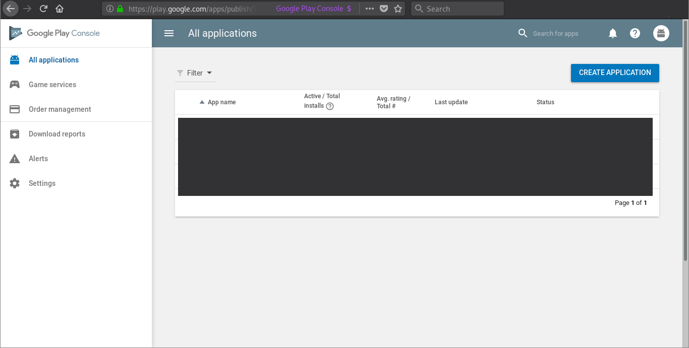
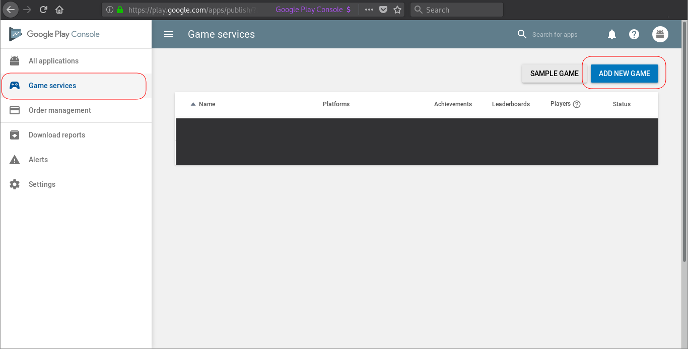
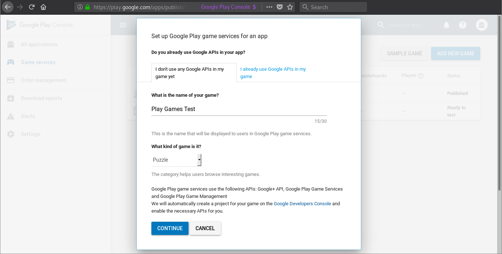

# How to use Google Play Games auth?
## Intro

Doing this is a hassle; i've tryed for many days to make it work. This is a consolidation of my results.

Following this: https://developers.google.com/games/services/console/enabling

WIP: IT HASNT WORKED YET!

## Concepts

### Play Console vs Cloud Console

Google has two consoles: the play console is related to publishing games on the Play Store and using the Google Play Games. Cloud Console is the regular console for anything Google Cloud related (GAE, GCE, IAM, etc, etc). Don't get those mixed up!

## Setup

Firstly, create a blank project with android-studio (you can use their wizards dialog for that).

Then, you must generate a new keystore; just run:

```bash
    keytool -genkey -v -keystore my-release-key.keystore -alias alias_name -keyalg RSA -keysize 2048 -validity 10000
```

Put a password of your choosing. This is a not a personal password of yours, it's just to encrypt this file, that you might share with other people on the project. So just generate a random one and keep it in a secure place for safekeeping.

Then you need to fill a lot of information. Normally I fill only my name (first name) and leave everything else UNKNOWN. Notice that in the end you must explicitly write [yes] to accept everything.

For the second password, just press enter to use the same as before (you could have two, but that'd be too much, I guess).

Finally, you need to get the SHA1 key associated with the key you generated; for that, just run:

```bash
    keytool -list -v -keystore test.keystore -alias test -storepass 123test -keypass 123test 2> /dev/null | grep "SHA1:" | rex '\s*SHA1: (.*)' '$1'
```

## Step 1. Sign in to the Google Play Console

Go [here](https://play.google.com/apps/publish/); if you are not logged in with Google, do so. If you've never accessed Google Play Console, you might need to accept some terms.

You will see something like this:



Then, click on `Game Services` on the left sidebar (you can open it clicking on the hamburger icon), and then on the `ADD NEW GAME` blue button near the top right corner.



Select `I don't use any Google APIs in my game yet`; add the name of your game and the category of your choosing. These will have no effects on the rest of the process.



Then go to:

> Linked apps -> Android -> Save and continue

Then

> Authorize app now -> put your SHA1

Here you can get your clientId and appId; save those somewhere safe.

> appId: 13 digits number

> clientId: appId + some random string + ".apps.googleusercontent.com"

## Step 2. Link your android project to the account you created

Create a ids file (app/src/main/res/values/ids.xml), with the following content:

```xml
<?xml version="1.0" encoding="utf-8"?>
<resources>
    <item name="app_id" type="string" value="your app id" />
</resources>
```

Then edit your manifest file (app/src/main/AndroidManifest.xml) and add the following lines (WHERE?):

```xml
<meta-data android:name="com.google.android.gms.games.APP_ID" android:value="@string/app_id" />
<meta-data android:name="com.google.android.gms.version" android:value="@integer/google_play_services_version"/>
```

Add the following to your gradle file (build.gradle) (WHICH ONE?):

```grovy
deps internal
    implementation "com.google.android.gms:play-services-games:${gms_library_version}"
    implementation "com.google.android.gms:play-services-auth:${gms_library_version}"
root external

ext {
    gms_library_version = '11.6.2'
}
```
